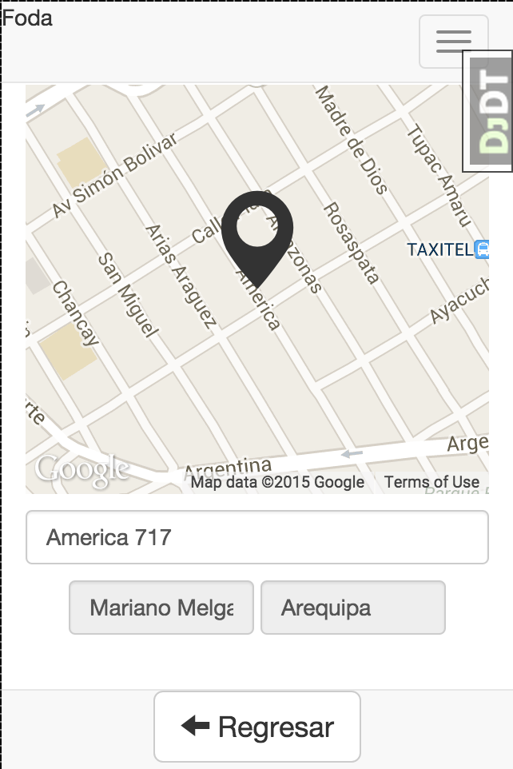

# foda-entrevista

En el archivo location.js se llama a la api de Google maps para crear un mapa en la pantalla

La tarea es crear algo similar a easy taxi. Es decir colocar algun simbolo sobre el mapa, 
y despues de arrastrar el mapa se actualizan los campos de dirección, distrito y ciudad, 
tomando como referencia el punto senhalado en el mapa.

## Tecnologias usadas:

Javascript + jQuery + Google Maps API

## Control de versiones:
Git

## Repositorio:
Github

## Procedimiento:
- Se procederá a hacer un fork del repositorio en github.
- Se procederá a implementar la solución en base al problema, no hay restricciones sobre el IDE o 
herramientas a utilizar, aunque la información detallada deberá estar presente en el archivo 
README del repositorio.
- El avance se evaluará en base al código que sea subido al repositorio dentro de la hora límite 
(git posee un registro preciso de esta información y en base a esa se sujetará la evaluación), 
si se registran cambios en el repositorio posteriores al tiempo máximo, es muy probable que no sean 
tomados en cuenta .

## Evaluación

Los puntos de evaluación serán los siguientes:

- Correcto uso de git y cumplimiento del horario establecido (20 %)
- Funcionamiento de la solución implementada y orientado al problema especificado (70 %)
- Legibilidad del código (10%)
